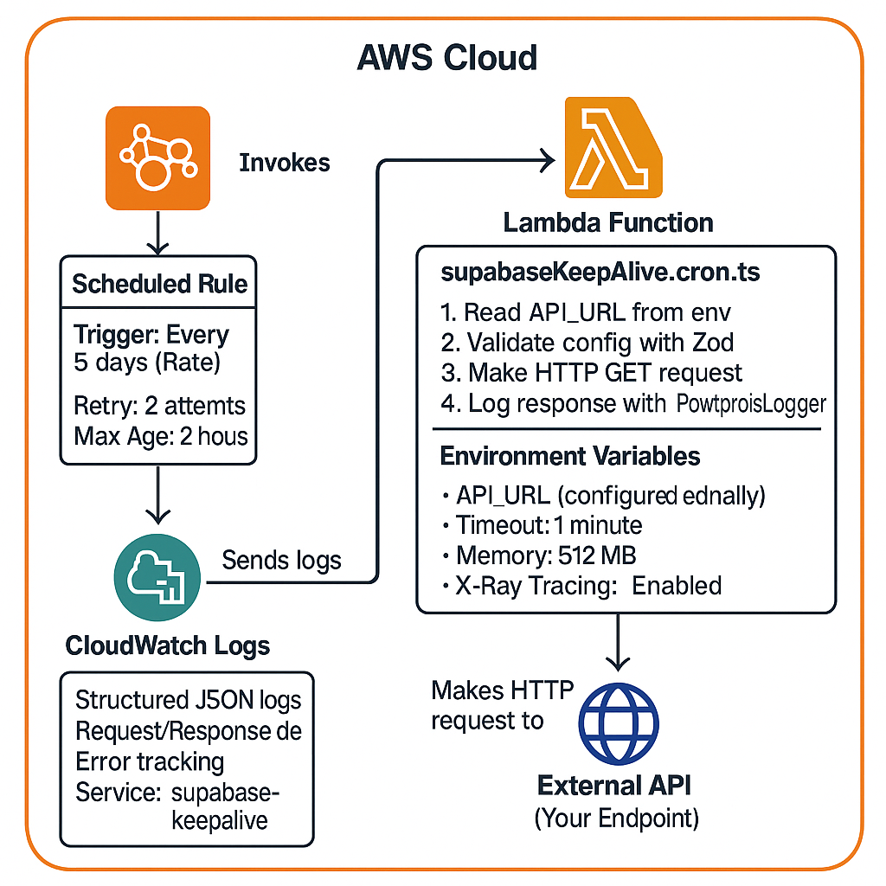

# Keepalive Scheduler CDK

An AWS CDK project that deploys a Lambda function triggered by EventBridge to keep connections alive by making periodic HTTP GET requests every 5 days.

## Architecture Diagram



## Architecture Components

### EventBridge Scheduled Rule
- Triggers Lambda function every 5 days using rate-based schedule
- Configured with retry policy (2 attempts, 2-hour max event age)
- Rule name: `{AppName}-supabase-keepalive-schedule`

### Lambda Function
- Runtime: Node.js 22 (NODEJS_22_X)
- Timeout: 1 minute
- Memory: 512 MB
- X-Ray tracing enabled for distributed tracing
- Bundled with esbuild for optimized deployment

### CloudWatch Logs
- Structured JSON logging using AWS Lambda Powertools
- Automatic log retention policies
- Service name: `supabase-keepalive`

### IAM Permissions (Auto-configured by CDK)
- Lambda execution role with CloudWatch Logs write permissions
- EventBridge permissions to invoke Lambda
- X-Ray write permissions for tracing

## Project Structure

```
.
├── app/
│   └── src/
│       └── supabaseKeepAlive/
│           └── cron/
│               ├── config.ts                          # Zod config validation
│               ├── supabaseKeepAlive.cron.ts          # Lambda handler
│               └── supabaseKeepAlive.cron.types.ts    # Type definitions
├── infra/
│   ├── common/
│   │   └── StandardLambda.ts                          # Reusable Lambda base class
│   ├── stacks/
│   │   └── keepAlive/
│   │       ├── constructs/
│   │       │   └── cron/
│   │       │       └── supabaseKeepAlive.construct.ts # Cron construct
│   │       └── stack.ts                               # Main stack definition
│   └── main.ts                                        # CDK app entry point
├── cdk.json                                           # CDK configuration
└── package.json
```

## Prerequisites

- Node.js 22.x or later
- AWS CLI configured with credentials
- AWS CDK CLI: `npm install -g aws-cdk`
- AWS Profile configured (see Configuration section below)

## Installation

```bash
npm install
```

## Configuration

### AWS Profile Setup

This project uses AWS profiles to manage credentials. You'll need to configure an AWS profile before deployment.

**Create a new AWS profile:**

1. Run the AWS configure command with your profile name:
```bash
aws configure --profile your-profile-name
```

2. Enter your credentials when prompted:
   - AWS Access Key ID
   - AWS Secret Access Key
   - Default region (e.g., `ap-southeast-2`)
   - Default output format (e.g., `json`)

**Update package.json scripts:**

After creating your AWS profile, update the deployment scripts in [package.json](package.json) to use your profile name. Replace `promie` with your profile name:

```json
"scripts": {
  "deploy": "AWS_PROFILE=your-profile-name npm run build && AWS_PROFILE=your-profile-name npx cdk deploy",
  "diff": "AWS_PROFILE=your-profile-name npx cdk diff",
  "synth": "AWS_PROFILE=your-profile-name npx cdk synth",
  "destroy": "AWS_PROFILE=your-profile-name npx cdk destroy"
}
```

### Environment Variables

The Lambda function requires the following environment variable to be configured:

| Variable | Description | Default | Required |
|----------|-------------|---------|----------|
| `API_URL` | The endpoint URL to make GET requests to | Empty string | Yes |

### Setting the API URL

You must configure the `API_URL` environment variable after deployment using the AWS Console:

1. Go to [AWS Lambda Console](https://console.aws.amazon.com/lambda)
2. Find your function: `{AppName}-SupabaseKeepAlive`
3. Navigate to **Configuration** > **Environment variables**
4. Click **Edit**
5. Add/Edit the `API_URL` environment variable
6. Save changes

Example: `https://your-api.example.com/health`

## Deployment

### First-time deployment

#### 1. Bootstrap CDK

Before you can deploy any CDK stack, you need to bootstrap your AWS environment. This creates the necessary AWS resources (S3 bucket for assets, IAM roles, etc.) that CDK needs to deploy your stacks.

**What is bootstrapping?**
Bootstrapping is a one-time setup per AWS account and region. It creates a CloudFormation stack called `CDKToolkit` that contains:
- S3 bucket for storing deployment assets (Lambda code, etc.)
- ECR repository for container images
- IAM roles for CDK deployments
- SSM parameters for versioning

**Bootstrap command:**
```bash
AWS_PROFILE=your-profile-name npx cdk bootstrap aws://YOUR_ACCOUNT_ID/YOUR_REGION
```

Example:
```bash
AWS_PROFILE=my-profile npx cdk bootstrap aws://123456789012/us-east-1
```

You only need to run this once per account/region combination. If you've already bootstrapped this account and region before, you can skip this step.

**Note:** Replace `your-profile-name` with the AWS profile you configured earlier, and use your actual AWS account ID and region.

#### 2. Build the TypeScript code
```bash
npm run build
```

#### 3. Review the changes
```bash
npm run diff
```

#### 4. Deploy to AWS
```bash
npm run deploy
```

This will build and deploy your stack using the AWS profile you configured in package.json.

